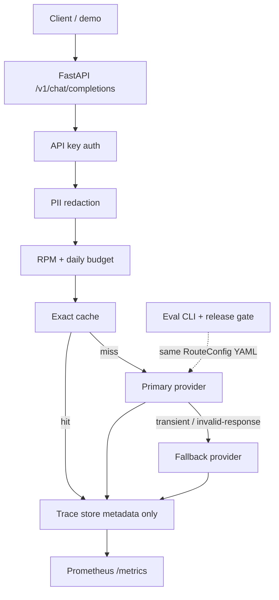

# Architecture

## Request path (implemented)

```text
Client / demo / eval CLI
        |
        v
FastAPI gateway  (POST /v1/chat/completions)
  auth → PII redact → rate/budget → exact cache
    → primary (timeout, 1 retry, circuit) → fallback
    → trace metadata + Prometheus metrics
        |
        +-- FakeProvider (local/CI, default)
        +-- OpenAICompatibleProvider (`provider: openai` + OPENAI_API_KEY)

Evaluation CLI
  dataset JSONL → deterministic metrics → baseline compare → exit code
```



## Persistence choices (v1)

| Concern | HANDOFF target | v1 implementation | Upgrade path |
|--------|----------------|-------------------|--------------|
| Traces | PostgreSQL | In-memory (+ `SqliteTraceStore` available) | Same `TraceStore` protocol |
| Cache / RPM | Redis | Process-local `MemoryCache` / `RateLimiter` | Multi-worker → Redis |
| Providers | Real + fake | Fake (default); `openai` via env | `OPENAI_API_KEY` + optional `OPENAI_BASE_URL` |

Docker Compose runs **one gateway container**. Shipping idle Postgres/Redis before the adapters exist would be theater.

## Evaluation control plane

```text
configs/support-v1.yaml  ──┐
configs/support-bad.yaml ──┼─► python -m control_plane eval
evals/escalations.jsonl  ──┘         │
                                     v
                              metrics JSON
                                     │
                      evals/baselines/support-v1.json
                                     │
                              pass → exit 0
                              fail → exit 1
```

Hard gate (no LLM judge required):

- schema validity = 100%
- classification accuracy drop ≤ 2 pp
- citation coverage ≥ 95%
- mean cost rise ≤ 20% (unless `--allow-cost-override`)
- p95 latency rise ≤ 25% (unless `--allow-latency-override`)

## Trust boundaries

- Tenant API keys stored as SHA-256 hashes only.
- Traces never include message bodies or unredacted prompts.
- Regex PII redaction covers email / phone / `ACCT-*` style IDs — known false negatives on novel formats.
- Exact cache only (temperature unset or 0); no semantic cache.
